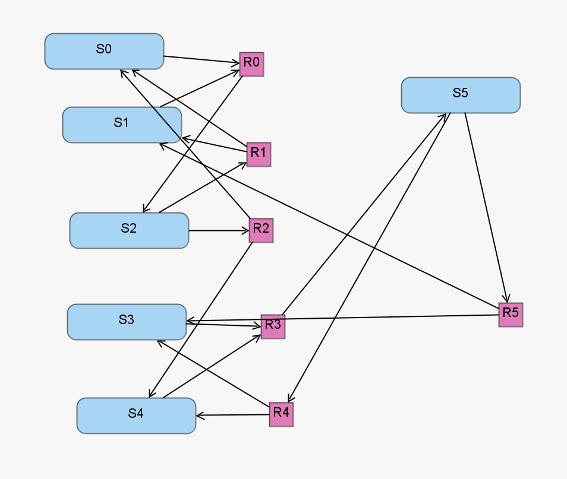

The enzymatic futile cycle model represents the futile cycle motif, which appears in many biological pathways including GTPase cycles, MAPK cascades, and glucose mobilization. This model serves as an archetypal small biochemical reaction network [1]. The enzymatic futile cycle model includes six chemical speices reacting via six reaction channels.

[1] Kuwahara, H., Mura, I.: An efficient and exact stochastic simulation method to analyze rare events in biochemical systems. The Journal of Chemical Physics 129(16), 165101 (Oct 2008). https://doi.org/10.1063/1.2987701