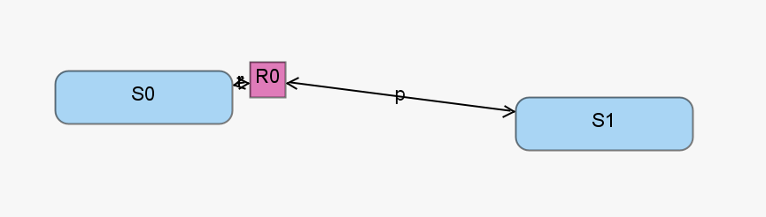

The reversible isomerization model represents a single chemical substance transitioning between two conformational isomers. This model is the simplest chemical reaction network included in this paper and serves as an archetypal very simple network [1]. The reversible isomerization model includes two chemical species reacting via two reaction channels.

[1] Roh, M.K., Daigle, B.J., Gillespie, D.T., Petzold, L.R.: State-dependent doubly weighted stochastic simulation algorithm for automatic characterization of stochastic biochemical rare events. The Journal of Chemical Physics 135(23), 234108 (Dec 2011). https://doi.org/10.1063/1.3668100