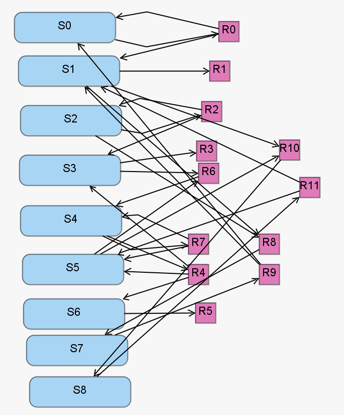

The simplified motility reguation model represents the gene regulatory network which regulates flagella formation in Bacillus subtilis. This model serves as an archetypal gene regulatory network and is closely related to the genetic designs which follow [1]. The simplified motility regulation model includes nine chemical species reacting via 12 reaction channels.

[1] Gillespie, C.S., Golightly, A.: Guided proposals for efficient weighted stochastic simulation. The Journal of Chemical Physics 150(22), 224103 (Jun 2019). https://doi.org/10.1063/1.5090979