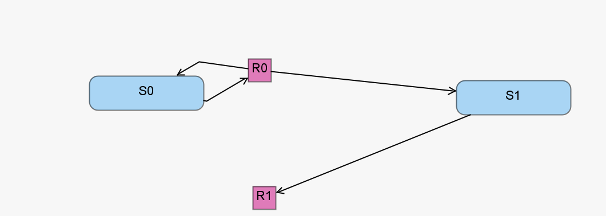

The single species production-degradation model represents the constitutive production and degradation of a single chemical species. This model also serves as an archetypal very simple network [1]. The single species production-degradation model includes two chemical species
reacting via two reaction channels.

[1]  Kuwahara, H., Mura, I.: An efficient and exact stochastic simulation method to analyze rare events in biochemical systems. The Journal of Chemical Physics 129(16), 165101 (Oct 2008). https://doi.org/10.1063/1.2987701
