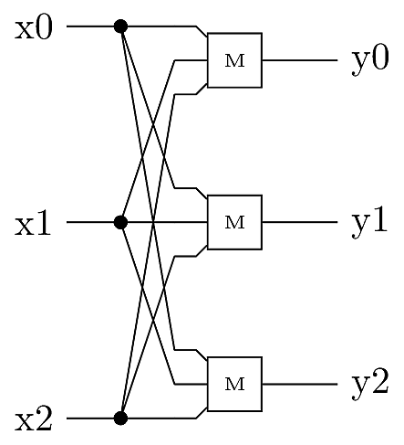

# Triple Modular Redundancy (TMR) Model

This case example models a Triple Modular Redundancy (TMR) circuit
wherein logic functions and signals are instantiated in triplicate. 
Logic states are corrected using majority vote modules, so that a 
single error can be corrected. In this model we assume that all signals
are susceptible to momentary upsets, including the majority outputs.


## Description of the Circuit


The TMR circuit shown below presumes that a logic system is replicated for a total 
of three instances. Three logic signals x0, x1, and x2 represent instances
the same logic value. Any of the signals may momentarily "flip" to an 
erroneous value due to interference or noise. The majority gates labeled `M`
output the majority decision among the three input signals. Since the majority 
gates may also be susceptible to upsets, there are three independent majority 
gates so that there is never a single point of failure.



Reference:

* R. E. Lyons and W. Vanderkulk, "The use of triple-modular redundancy to improve
computer reliability." *IBM Journal of Research and Development*, 6(2):200, 1962.

## PRISM Model

The PRISM model for this circuit is provided in 
`tmr.pm`. The input signals are assumed to be 0 (when correct),
so a value of `1` indicates an error. The momentary upset rate
is specified via constant `epsilon`, and the signal recovery rate
is `Rc`. 

The initial states are constrained by the integer
constant named `initialErrors`, which indicates how
many signal errors are present in the initial state.

Two example properties are given in `tmr.props`:

* `P=? [ F[T,T] y1+y2+y3>1 ]`  evaluates the probability 
that a non-correctable error state exists at time `T`. The
constant `T` is a `double` indicating the elapsed time.
* `S=? [ y1+y2+y3>1 ]` evaluates the steady-state probability
that a non-correctable error state exists in the circuit's
output.

The TMR's output error probability is not strongly dependent on 
time, so these two properties should usually be close to each other.


## Example results:


### `T=0`, `initialErrors=1`

This case models the initial error probability. Since the majority 
gates have undefined (or unconstrained) initial output values, 
the instantaneous error probability is indeteminate. 

```
prism -const T=0 -const initialErrors=1 tmr.pm tmr.props
```

For the first property (at `T=0`) PRISM returns:

```
Result: [0.0,1.0]
```

For the second property (steady state) PRISM returns:

```
Result: [4.94427886688858E-4,4.94427886688858E-4]
```

### `T=1.0`, `initialErrors=1`

This case models the error probability after 1.0 time units.
Since this is well beyond the mean signal recovery time `1/Rc`,
the transient error probability should be nearly equal to the steady
state.

```
prism -const T=1.0 -const initialErrors=1 tmr.pm tmr.props
```

For the first property (at `T=0`) PRISM returns:

```
Result: [4.944279220969286E-4,4.94427973657968E-4]
```

For the second property (steady state) PRISM returns:

```
Result: [4.94427886688858E-4,4.94427886688858E-4]
```

