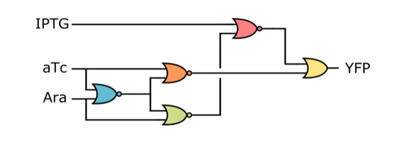
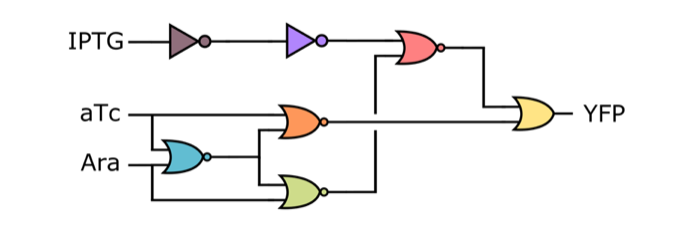

### Circuit0x8E

This circuit is part of the genetic circuits designed by the software tool Cello [1]. The circuit has three input arguments IPTG, aTc, and Ara and one output argument YFP.

In the laboratory, circuit 0x8E showed an unexpected, glitching behavior. Further analysis resulted in two more designs of the circuit as well as the analysis of its glitching behavior [2].

There are two types of glitches. In one type, the output should remain in a low state during an input transition (Zero Glitch). In the other type, the output should remain at a high state (One Glitch) during an input transition. More information can be found in [1-2].

1. Nielsen, A. A. K.; Der, B. S.; Shin, J.; Vaidyanathan, P.; Paralanov, V.; Strychalski, E. A.; Ross, D.; Densmore, D.; Voigt, C. A. Genetic Circuit Design Automation. Science 2016, 352 (6281), aac7341–aac7341. https://doi.org/10.1126/science.aac7341.

2. Fontanarrosa, P.; Doosthosseini, H.; Borujeni, A. E.; Dorfan, Y.; Voigt, C. A.; Myers, C. Genetic Circuit Dynamics: Hazard and Glitch Analysis. ACS Synthetic Biology 2020, 15.
