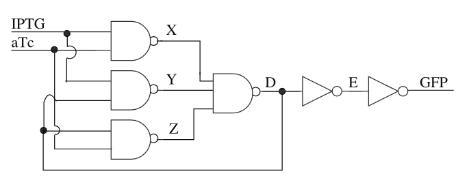
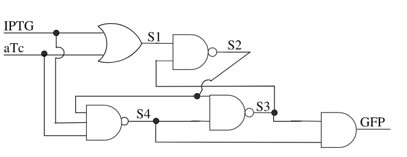
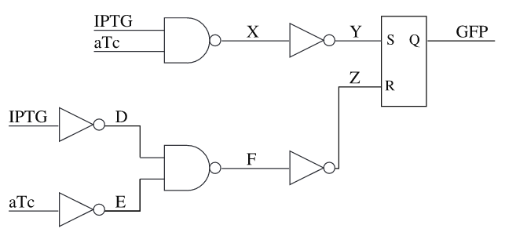

### Muller C-element

This genetic circuit implements a state-holding gate called Muller C-element. If both inputs are high, its output goes high. If both inputs are low, the output is low. If the inputs are mixed, it retains its previous state. The three designs are the Majority, Speed_Independent, and Toggle Switch design [1].

1. Madsen, C.; Zhang, Z.; Roehner, N.; Winstead, C.; Myers, C. Stochastic Model Checking of Genetic Circuits. J. Emerg. Technol. Comput. Syst. 2014, 11 (3), 1–21. https://doi.org/10.1145/2644817.
