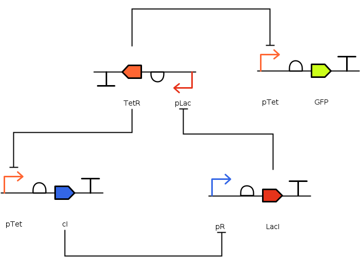

### Repressilator

The repressilator consists of three promoters each with a repressor gene. It is a cyclic negative-feedback loop, periodically inducing the synthesis of green fluorescent proteins [1].

1. Elowitz, M. B.; Leibler, S. A Synthetic Oscillatory Network of Transcriptional Regulators. Nature 2000, 403 (6767), 335–338. https://doi.org/10.1038/35002125.
