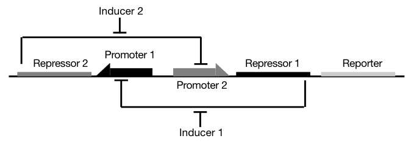

### Toggle Switch

The toggle switch is a state holding gate and consists of two promoters each followed by a coding sequence. Each promoter is repressed by the protein transcribed by the other promoter [1].

1. Gardner, T. S.; Cantor, C. R.; Collins, J. J. Construction of a Genetic Toggle Switch in Escherichia Coli. Nature 2000, 403 (6767), 339–342. https://doi.org/10.1038/35002131.
