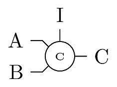
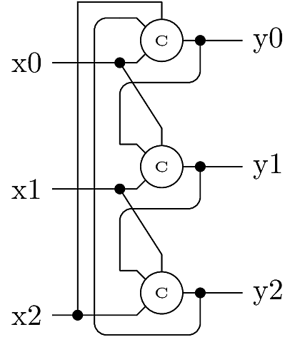

# Restorative Feedback (RFB) Model

This case example models a restorative feedback (RFB) circuit
for in-situ transient error correction in logic circuits and
systems. RFB can be classified as a type of Triple Modular
Redundancy (TMR) wherein logic functions and signals are 
instantiated in triplicate. Classical TMR systems use majority
vote to correct a single error, but cannot detect or correct
muliple errors. The RFB circuit is designed to correct momentary
upsets with better reliability than Majority TMR. RFB is able
to suppress multiple momentary faults when the feedback is
active.


## Description of the Circuit

The RFB circuit is based on a modified Muller C-element gate. 
The classical C-element is a binary-valued latch with behavior 
described as 

```
if (A==B)
  C = A;
```

When `A!=B` there is no change in `C`. 

In the RFB circuit, the modified C-element has two modes depending 
on an external clock. When the clock is low, the C-element is initialized
to the value of an extra input `I`. When the clock is high, the C-element
behaves as usual:

```
if (clk) begin
  if (A==B) 
     C = A;
end else 
  C = I;
```



The RFB circuit shown below presumes that a logic system is replicated for a total 
of three instances. Three logic signals x0, x1, and x2 represent instances
the same logic value. Any of the signals may momentarily "flip" to an 
erroneous value due to interference or noise. When the clock signal (not shown) 
is low, the outputs y0, y1, and y2 are initialized to values sampled from 
x1, x2, and x0, respectively.  When the clock is high, the C-element outputs
are passed in a feedback cycle which corrects errors and suppresses further upsets.



To see how a single error is corrected, suppose x0 is initially in error, 
so the input values are (x0,x1,x2)=(1,0,0). During the initialization, 
the output values are set to (y0,y1,y2)=(x3,x1,x2)=(0,1,0). When the 
clock swings high, the three C-elements see respective inputs (1,0), 
(0,0) and (0,1). Since C2 sees inputs (0,0), its output is changed to 
y2=0, so the outputs finally become (0,0,0) and the error is corrected.

Reference:

* Chris Winstead, Yi Luo, Eduardo Monzon, and Abiezer Tejeda, 
  "An Error Correction Method for Binary and Multiple-Valued Logic",
  *IEEE International Symposium on Multiple-Valued Logic*, 2011.
* Chris Winstead, Yi Luo, Eduardo Monzon, and Abiezer Tejeda, 
  "Error Correction via Restorative Feedback in M-ary Logic Circuits",
  *J. of Multiple Valued Logic and Soft Computing*, Vol. 23, pp. 337, 2014.


## PRISM Model

The PRISM model for this circuit is provided in 
`rfb.pm`. The input signals are assumed to be 0 (when correct),
so a value of `1` indicates an error. The momentary upset rate
is specified via constant `epsilon`, and the signal recovery rate
is `Rc`. There is also a latch upset rate `alpha` which affects
the C-element memory.

For a C-element with inputs `A` and `B`, upsets are modeled as
follows:

* When `A=B`: not susceptible to state upsets.
* When `A!=B`: susceptible to upset with rate `alpha`.

The initial states are constrained by the integer
constant named `initialErrors`, which indicates how
many signal errors occur when the clock transitions from
low to high. The PRISM model represents behavior during
the correction phase, where the speed and ultimate error
probability are determined by the circuit's feedback
dynamics.

Two example properties are given in `rfb.props`:

* `P=? [ F[T,T] y1+y2+y3>1 ]`  evaluates the probability 
that a non-correctable error state exists at time `T`. The
constant `T` is a `double` indicating the elapsed time in
the circuit's correction phase.
* `S=? [ y1+y2+y3>1 ]` evaluates the steady-state probability
that a non-correctable error state exists in the circuit's
output.


## Example results:

The results given here are informative in comparison to the classical
TMR model located in `../TMR`, demonstrating that RFB is more
reliable for a system with the indicated parameters.


### `T=0`, `initialErrors=1`

This case models the initial error probability before activating
restorative feedback. Since there is initially only one error,
we expect the timed property to be zero.

```
prism -const T=0 -const initialErrors=1 rfb.pm rfb.props
```

For the first property (at `T=0`) PRISM returns:

```
Result: [0.0,0.0]
```

For the second property (steady state) PRISM returns:

```
Result: [1.272254163993728E-6,1.272254163993728E-6]
```

### `T=1.0`, `initialErrors=1`

This case models the error probability 1.0 time units after
activating restorative feedback. This case provides
information about the circuit's transient reliability.

```
prism -const T=1.0 -const initialErrors=1 rfb.pm rfb.props
```

For the first property (at `T=0`) PRISM returns:

```
Result: [4.3735439267849973E-4,4.3735439267849984E-4]
```

For the second property (steady state) PRISM returns:

```
Result: [1.272254163993728E-6,1.272254163993728E-6]
```

