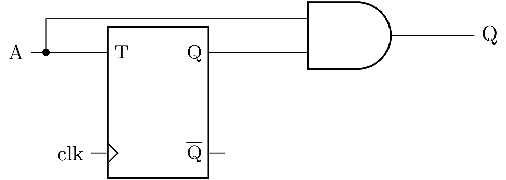

# Unipolar Stochastic Divide-By-Two Model

This case example models a stochastic divide-by-two circuit 
using the unipolar stochastic numerical format. In the 
unipolar format, a signal $x$ is a real number between 
0 and 1, encoded probabilistically in a binary signal 
$X(t)$. At any time $t$, the signal $X(t)=1$ with 
probability $x$, and $X(t)=0$ with probability $1-x$.

## Description of the Circuit

The divide-by-two circuit schematic is shown below. It accepts 
one stochastic input, $A(t)$, and produces a single output $Q(t)$. 
Ideally $Q$ should arrive at a steady-state probability $q=a/2$. 



The principle of operation is as follows. The toggle flip-flop
emits a bitstream $B(t)$ with steady-state probability $b=1/2$, 
independent of the input stream probability. The AND gate acts as 
a probability multiplier, so it emits a bitstream with probability 
$q=ab=q/2$. 

Reference:

* C. Winstead, "Tutorial on Stochastic Computation," 
  Chapter 2 in *Stochastic Computing: Techniques and Applications*, 
  ed. Gaudet and Gross, Springer, 2019.


## PRISM Model

The PRISM model for this circuit is provided in 
`divide_by_two.pm`. The input probability is given 
via the constant `a`. Internally, the stochastic 
input signal is `inA`, and the output signal is `Q`.

Three example properties are given in `divide_by_two.props`:

* `P=? [ F[T,T] Q = 1 ]`  evaluates the probability 
that Q=1 (i.e. the numerical output $q$) at `T` clock cycles, 
which relates to the circuit's response time. The constant `T`
is an integer.
* `S=? [ Q = 1 ]` evaluates the steady-state probability
that Q=1. 
* `P=? [ F[T,T] Q = 1 ] - S=? [ Q = 1 ]` evaluates the transient
absolute error in output probability at clock cycle `T`.

## Example results:

### `a=0.1` and `T=100` 

The expected output is $q=0.05$. 

```
prism --const a=0.1 --const T=100 divide_by_two.pm divide_by_two.props
```

For the first property (at 100 clock cycles) PRISM returns:

```
Result: 0.049999999984085816 (exact floating point)
```

For the second property (steady state) PRISM returns:

```
Result: 0.04999998765587841
```

For the third property (transient error) PRISM returns:

```
Result: 1.2328207406320235E-8
```

