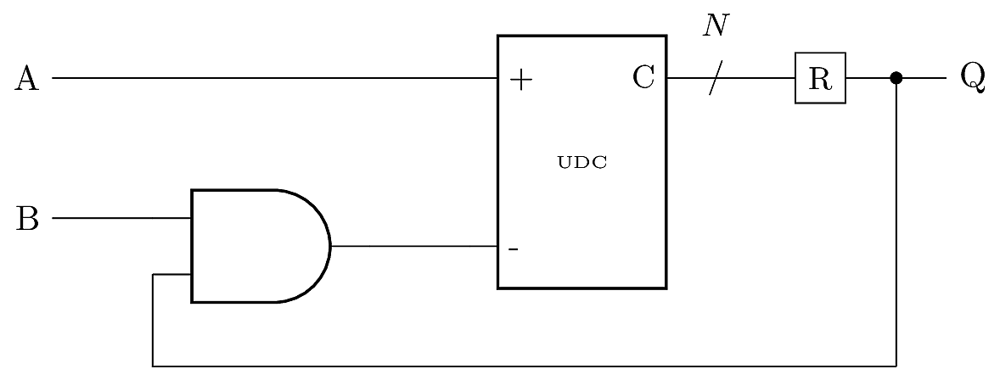

# Unipolar Stochastic Divider Model

This case example models a stochastic divider using 
the unipolar stochastic numerical format. In the 
unipolar format, a signal $x$ is a real number between 
0 and 1, encoded probabilistically in a binary signal 
$X(t)$. At any time $t$, the signal $X(t)=1$ with 
probability $x$, and $X(t)=0$ with probability $1-x$.

Two models are provided:

* `divider.pm` is a finite-state model.
* `divider_inf.pm` is an intinite-state model.

Both models rely on a finite up-down counter to 
estimate the average probability of a unary stochastic 
bitstream. The finite counter saturates at `MAX_COUNT`, 
which is a fixed constant in the model.

In the infinite-state model, the counter's limit is 
variable, initially +/-1 and increasing logarithmically
with respect to the elapsed clock cycles. This approach 
improves accuracy for calculations with small probabilities,
e.g. below 0.01, however the state complexity becomes 
unbounded in this model.


## Description of the Circuit

The divider circuit shematic is shown below. It accepts 
two stochastic inputs, $A(t)$ and $B(t)$, and produces a 
single output $Q(t)$. Ideally $Q$ should arrive at a 
steady-state probability $Q(t)=q=a/b$. 



The principle of operation is as follows. The signed up/down
counter (UDC) reaches equilibrium when its inputs have equal 
probability. The module R emits a bit stream with probability 
equal to the counter value C, scaled to the range (0,1).
The AND gate acts as a probability multiplier, so it emits bits 
with probability $qb$. Due to the feedback connection, at 
steady state we expect $qb=a$ and therefore $q=a/b$.

Reference:

* C. Winstead, "Tutorial on Stochastic Computation," 
  Chapter 2 in *Stochastic Computing: Techniques and Applications*, 
  ed. Gaudet and Gross, Springer, 2019.


## PRISM Model

The input probabilities are given via constants `a` and `b`. Internally, 
the stochastic input signals are `inA` and `inB`, and the output 
signal is `Q`.

Two example properties are given in `divider.props`:

* `P=? [ F[T,T] Q = 1 ]`  evaluates the probability 
that Q=1 (i.e. the numerical output $q$) at `T` clock cycles, 
which relates to the circuit's response time. The constant `T`
is an integer.
* `S=? [ Q = 1 ]` evaluates the steady-state probability
that Q=1. 

## Example results (finite state model):

### `a=0.1`, `b=0.3`, and `T=100` 

The expected output is $q=1/3$. 

```
prism --const a=0.1 --const b=0.3 --const T=100 divider.pm divider.props
```

For the first property (at 100 clock cycles) PRISM returns:

```
Result: 0.4665562152140168 (exact floating point)
```

For the second property (steady state) PRISM returns:

```
Result: 0.33333443639168
```


### `a=0.7`, `b=0.3`, and `T=100` 

In this case the ratio $a/b$ is greather than one, so the expected output 
is saturated close to $q=1$. 

```
prism --const a=0.1 --const b=0.3 --const T=100 divider.pm divider.props
```

For the first property (at 100 clock cycles) PRISM returns:

```
Result: 0.8790749994268042 (exact floating point)
```

For the second property (steady state) PRISM returns:

```
Result: 0.9881554646304057
```


## Example results (infinite state model):

### `a=0.001`, `b=0.1`

In this case PRISM is best used to simulate a path with 
10,000 clock cycles. The output bitstream `Q` is reported in 
column 9 of the output trace.

```
prism -simpath time=10000 data -const a=0.001 -const b=0.1 -const T=1000 divider_inf.pm
```

In this model PRISM is unable to provide the requested path length,
so it is not possible to compute the long-term transient behavior 
or the steady-state output probability using PRISM.
