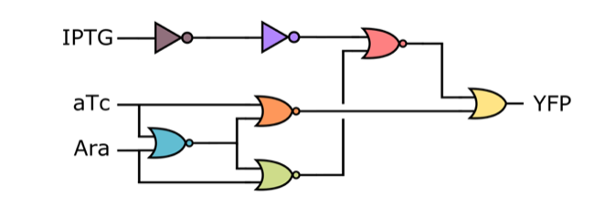

# Stochastic Model Case Studies

Within this repository are several case studies and scripts used to create and catalog models for various types of stochastic model checking. These models are mostly in the PRISM language and can be used in PRISM, STORM, or [STAMINA](https://github.com/fluentverification/stamina-cplusplus). Additionally, there are models for the IVy model checker as well as Python scripts used to generate such models. The models are organized into the following folders:

## Repository structure

### `./SBML` folder

Case studies of genetic designs represented in the _Systems Biology Markup Language_ (SBML) are stored in this directory. SBML encodes mathmatical models of biological processes.

### `./crn` Folder

Mostly contains IVy files for one of the following two types of models:

#### `./crn/DonovanYeastPolarization` subfolder

This folder contains several scripts to generate yeast polarization models in IVy, as well as some of those IVy files and their results. There is even a relevant PRISM file. *Yeast Polarization* occurs during yeast growth and is important in the budding process. These polarizations can be modelled using stochastic systems.

#### `./crn/KuwaharaEnzyme` subfolder

Contains PRISM and IVy files for the reaction of the Kuwahara Enzyme.

### `./prism` folder

Various relevant PRISM models (mostly conversions of the SBML files in `./SBML`) that can be used to model certain properties of systems. Can be run in STORM, PRISM, or STAMINA.

## Naming Convention

* 10_10: Production and degradation of molecules in steps of 10

* RBA: Reaction-based abstraction (remove irrelevant or rapid reactions)

* G0: Static zero glitch

* G1: Static one glitch

* unb: unbound prsim models

## Genetic Circuits

### Circuit0x8E

This circuit is part of the genetic circuits designed by the software tool Cello [1]. The circuit has three input arguments IPTG, aTc, and Ara and one output argument YFP.

In the laboratory, circuit 0x8E showed an unexpected, glitching behavior. Further analysis resulted in two more designs of the circuit as well as the analysis of its glitching behavior [2].

There are two types of glitches. In one type, the output should remain in a low state during an input transition (Zero Glitch). In the other type, the output should remain at a high state (One Glitch) during an input transition. More information can be found in [1-2].

### Muller C-element

This genetic circuit implements a state-holding gate called Muller C-element. If both inputs are high, its output goes high. If both inputs are low, the output is low. If the inputs are mixed, it retains its previous state. The three designs are the Majority, Speed_Independent, and Toggle Switch design [3].

### Toggle Switch

The toggle switch is a state holding gate and consists of two promoters each followed by a coding sequence. Each promoter is repressed by the protein transcribed by the other promoter [4].

### Repressilator

The repressilator consists of three promoters each with a repressor gene. It is a cyclic negative-feedback loop, periodically inducing the synthesis of green fluorescent proteins [5].

### Dual Feedback Oscillator

This design is an improved version of the repressilator [6].

## Chemical Reaction Networks

### Reversible Isomerization

The reversible isomerization model represents a single chemical species transitioning between two potential conformational isomers [7].

### Single Species Production-Degradation

The single species production-degradation model represents the constitutive production and degradation of a single chemical species [8].

### Enzymatic Futile Cycle

The enzymatic futile cycle model represents the futile cycle motif, which appears naturally in many pathways including GTPase cycles, MAPK cascades, and glucose mobilization [9]. 

### Modified Yeast Polarization

The modified yeast polarization model represents the pheromone induced G-protein cycle in _Saccharomyces cerevisia_ [10].

### Simplified Motility Regulation

The simplified motility regulation model represents the gene regulatory network which regulates flagella formation in _Bacillus subtilis_ [9].

### References

1. Nielsen, A. A. K.; Der, B. S.; Shin, J.; Vaidyanathan, P.; Paralanov, V.; Strychalski, E. A.; Ross, D.; Densmore, D.; Voigt, C. A. Genetic Circuit Design Automation. Science 2016, 352 (6281), aac7341–aac7341. https://doi.org/10.1126/science.aac7341.

2. Fontanarrosa, P.; Doosthosseini, H.; Borujeni, A. E.; Dorfan, Y.; Voigt, C. A.; Myers, C. Genetic Circuit Dynamics: Hazard and Glitch Analysis. ACS Synthetic Biology 2020, 15.

3. Madsen, C.; Zhang, Z.; Roehner, N.; Winstead, C.; Myers, C. Stochastic Model Checking of Genetic Circuits. J. Emerg. Technol. Comput. Syst. 2014, 11 (3), 1–21. https://doi.org/10.1145/2644817.

4. Gardner, T. S.; Cantor, C. R.; Collins, J. J. Construction of a Genetic Toggle Switch in Escherichia Coli. Nature 2000, 403 (6767), 339–342. https://doi.org/10.1038/35002131.

5. Elowitz, M. B.; Leibler, S. A Synthetic Oscillatory Network of Transcriptional Regulators. Nature 2000, 403 (6767), 335–338. https://doi.org/10.1038/35002125.

6. Stricker, J.; Cookson, S.; Bennett, M. et al. A Fast, Robust and Tunable Synthetic Gene Oscillator. Nature 456, 516–519 (2008). https://doi.org/10.1038/nature07389.

7. Roh, M. K.; Daigle, B. J., Jr.; Gillespie, D. T.; Petzold, L. R. State-dependent Double Weighted Stochastic Simulation Algorithm for Automatic Characterization of Stochastic Biochemical Rare Events. J. Chem. Phys. 135, 234108 (2011). https://doi.org/10.1063/1.3668100

8. Kuwahara, H.; Mura, I. An Efficient and Exact Stochastic Simulation Method to Analyze Rare Events in Biochemical Systems. J. Chem. Phys. 129, 165101 (2008). https://doi.org/10.1063/1.2987701

9. Ahmadi, M.; Thomas, P. J.; Buecherl, L. et al. A Comparison of Weighted Stochastic Simulation Methods for the Analysis of Genetic Circuits. ACS Synthetic Biology, Article ASAP (2022). https://doi.org/10.1021/acssynbio.2c00553

10. Drawert, B.; Hellander, S.; Trogdon, M. et al. A Framework for Discrete Stochastic Simulation on 3D Moving Boundary Domains. J. Chem. Phys. 145, 184113 (2016). https://doi.org/10.1063/1.4967338